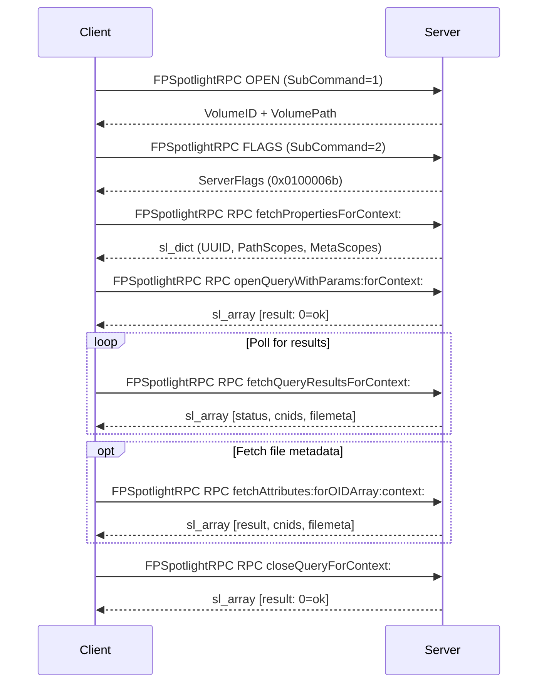
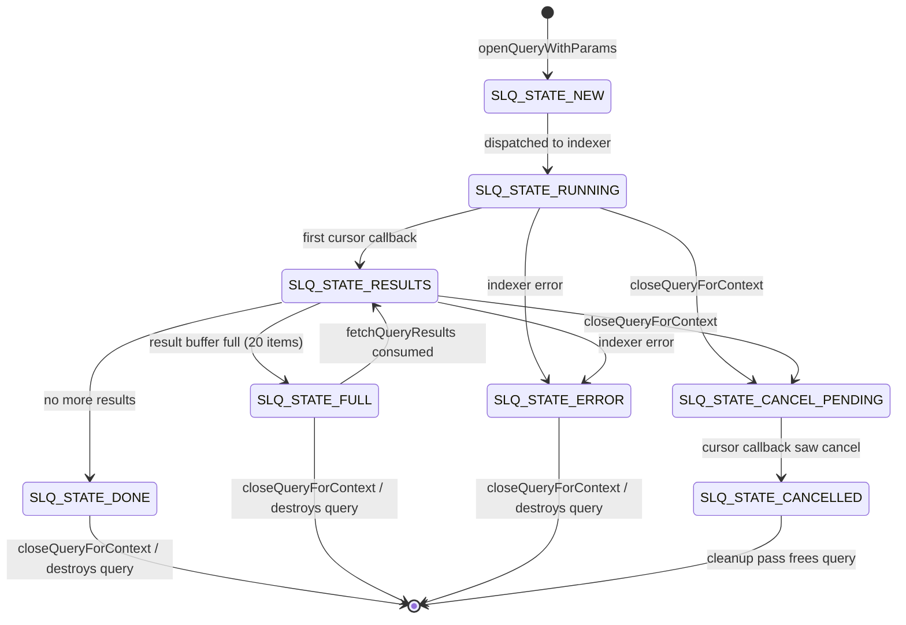
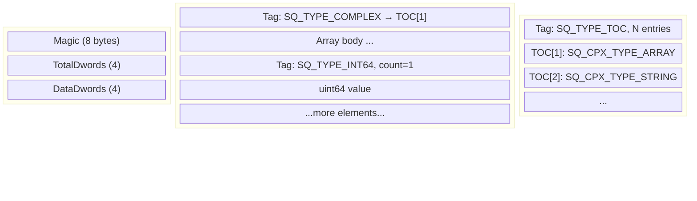

# FPSpotlightRPC

Executes Spotlight metadata search and attribute operations on a volume.

This is an open source community documentation of this AFP command based on
reverse engineering by the Netatalk developement team through packet captures.

```c
uint8_t  CommandCode
uint8_t  Pad
uint16_t VolumeID
uint32_t Flags
int32_t  SubCommand
uint32_t Reserved
8 bytes  SubCommandData
```

## Parameters

*CommandCode*  
`kFPSpotlightRPC` (76).

*Pad*  
Pad byte.

*VolumeID*  
Volume identifier for the volume to operate on. The volume must have been
previously opened with `FPOpenVol` and must have Spotlight indexing enabled.

*Flags*  
Purpose unknown. Observed in all captured traffic to always be `0x00008004`.

*SubCommand*  
Identifies which top-level operation to perform. Must be one of the following
values:

| Value | Constant                 | Description                              |
|-------|--------------------------|------------------------------------------|
| 1     | `SPOTLIGHT_CMD_OPEN`     | Open Spotlight context for a volume.     |
| 2     | `SPOTLIGHT_CMD_FLAGS`    | Query server capability flags.           |
| 3     | `SPOTLIGHT_CMD_RPC`      | Execute a Spotlight RPC method call.     |
| 4     | `SPOTLIGHT_CMD_OPEN2`    | Open Spotlight context (alternate form). |

*Reserved*  
Purpose unknown. Observed to always be zero (`0x00000000`). The field is
never interpreted by the server in any known implementation; "Reserved" is
inferred, not documented.

*SubCommandData*  
Eight bytes whose purpose is entirely unknown. They are never read or
interpreted by the server in any known implementation; their existence is
inferred only from the fixed 22-byte offset at which the `RPCPayload` begins.
Observed to be zero in all captured traffic.

*RPCPayload*  
For `SubCommand` = `SPOTLIGHT_CMD_RPC` (3) only: a Spotlight marshalled data
structure carrying the RPC method name and arguments. Absent for all other
SubCommand values. See "Spotlight Data Encoding" for format details.

*Result*  
`kFPNoErr` if no error occurred, `kFPAccessDenied` if the volume ID is
unknown or Spotlight is disabled, or `kFPMiscErr` if an error occurred that
is not specific to AFP.

*ReplyBlock*  
If the result code is `kFPNoErr`, the server returns a SubCommand-specific
reply block as described in "SubCommand Reply Formats" below.

## Discussion

`FPSpotlightRPC` is an AFP command introduced in Mac OS X 10.4 Tiger
that exposes Apple's Spotlight metadata search facility over AFP.

The command multiplexes four distinct operations under a single AFP command
code, selected by the `SubCommand` field. The two `OPEN` variants and
`FLAGS` operate on the fixed binary fields alone. The `RPC` subcommand
carries a variable-length marshalled data payload containing an
Objective-C-style selector string and its arguments, implemented as a
nested array structure.

A client wishing to search a volume must follow this sequence:

1. `SPOTLIGHT_CMD_OPEN` or `SPOTLIGHT_CMD_OPEN2` — establish context.
2. `SPOTLIGHT_CMD_FLAGS` — negotiate capability flags.
3. `SPOTLIGHT_CMD_RPC` / `fetchPropertiesForContext:` — obtain volume scope and UUID.
4. `SPOTLIGHT_CMD_RPC` / `openQueryWithParams:forContext:` — submit a query.
5. `SPOTLIGHT_CMD_RPC` / `fetchQueryResultsForContext:` — poll for results (repeat as necessary).
6. `SPOTLIGHT_CMD_RPC` / `fetchAttributesForOIDArray:context:` — fetch metadata for results (optional).
7. `SPOTLIGHT_CMD_RPC` / `closeQueryForContext:` — release server-side query resources.



## SubCommand Reply Formats

### SPOTLIGHT_CMD_OPEN (1) and SPOTLIGHT_CMD_OPEN2 (4)

Establishes a Spotlight context for the specified volume and returns the
server-side volume path. Both variants produce identical replies.

| Name and size          | Data                                           |
|------------------------|------------------------------------------------|
| `VolumeID` (`uint32_t`) | The volume identifier, stored big-endian.     |
| `Reserved` (`uint32_t`) | Zero.                                         |
| `VolumePath` (variable) | Null-terminated UTF-8 path to the volume root on the server. |

### SPOTLIGHT_CMD_FLAGS (2)

Returns a 32-bit value whose structure and semantics are entirely unknown.
The Netatalk server returns `0x0100006b`. The Helios AFP server is known to return
`0x1eefface`. Whether the bits individually encode capabilities, or the value
is an opaque magic constant, is not established.

| Name and size           | Data                                           |
|-------------------------|------------------------------------------------|
| `ServerFlags` (`uint32_t`) | Big-endian capability flags bitmask.        |

### SPOTLIGHT_CMD_RPC (3)

Executes a Spotlight RPC method. The reply begins with a 4-byte reserved
field (zeroes), followed by a Spotlight-marshalled data structure.

| Name and size           | Data                                                |
|-------------------------|-----------------------------------------------------|
| `Reserved` (4 bytes)    | Zero.                                               |
| `RPCReply` (variable)   | Spotlight-marshalled `DALLOC_CTX` reply. Format depends on the RPC method invoked. See "RPC Methods" below. |

## RPC Methods

All RPC method calls share the same outer structure for their `RPCPayload`:

```c
DALLOC_CTX {
    DALLOC_CTX[0] {         /* context/header array             */
        char *  method      /* Objective-C selector string      */
        uint64  ctx1        /* query context handle (high word) */
        uint64  ctx2        /* query context handle (low word)  */
    }
    DALLOC_CTX[1] {         /* arguments dictionary/array */
        /* ...method-specific key/value pairs... */
    }
}
```

The `method` string at position `[0][0][0]` determines which server handler
is invoked. Context handles `ctx1` and `ctx2` are assigned by the client and
used as an opaque query identifier throughout the lifecycle of a search.

### fetchPropertiesForContext

Returns volume metadata properties required before opening queries. Takes
no arguments beyond the method name and context.

**Request arguments:** None (inner argument array is absent or empty).

**Reply:**

```c
sl_dict_t {
    "kMDSStoreMetaScopes"        /* sl_array_t [ "kMDQueryScopeComputer" ] */
    "kMDSStorePathScopes"        /* sl_array_t [ <volume root path> ]      */
    "kMDSStoreUUID"              /* sl_uuid_t  <16-byte volume UUID>       */
    "kMDSStoreHasPersistentUUID" /* sl_bool_t  true                        */
}
```

### openQueryWithParams:forContext

Submits a Spotlight query string to be executed asynchronously. Results are
retrieved in subsequent `fetchQueryResultsForContext:` calls.

**Request arguments (keyed in DALLOC_CTX[1]):**

| Key                  | Type         | Description                                               |
|----------------------|--------------|-----------------------------------------------------------|
| `kMDQueryString`     | `char *`     | Spotlight predicate query string (Mac UTF-8 encoding).   |
| `kMDAttributeArray`  | `sl_array_t` | Array of `char *` metadata attribute names to return.    |
| `kMDScopeArray`      | `sl_array_t` | Optional. Array of path strings to restrict search scope. Defaults to the volume root. |
| `kMDQueryItemArray`  | `sl_array_t` | Optional. `sl_cnids_t` CNID filter; only items with these CNIDs are returned. |

**Reply:**

```c
sl_array_t [ uint64_t result ]
```

`result` is `0` on success or `UINT64_MAX` if the query could not be
started (e.g., the indexer is unavailable or the query string is invalid).

### fetchQueryResultsForContext

Retrieves the next batch of search results for a running query. Results
are delivered incrementally; this call must be repeated until the status
field indicates completion.

**Request arguments:** Context handles only (`ctx1`, `ctx2` in the header
array at positions 1 and 2). No DALLOC_CTX[1] argument array is required.

**Reply:**

```c
sl_array_t {
    uint64_t    status          /* 35 = results pending, 0 = done */
    sl_cnids_t  cnids           /* CNIDs of matched items         */
    sl_filemeta_t {
        nil                     /* leading nil sentinel (reason unknown) */
        sl_array_t              /* one inner array per result item,      *
            <attribute values>   *  in kMDAttributeArray order           */
        /* ... */
    }
}
```

The `status` value `35` means the query is still running and more results
may be available; the client should call `fetchQueryResultsForContext:`
again. A `status` of `0` means all results have been delivered. On error the
reply status is `UINT64_MAX`.

> **Implementation note:** The condition for returning `35` versus `0`
is whether the query has reached `SLQ_STATE_DONE` or beyond:
all states prior to DONE (RUNNING, RESULTS, FULL) return `35`;
DONE and later states return `0`.
The `filemeta` array always begins with a nil entry for reasons unknown.



The server batches at most 20 file results per call. When `status` is 35,
the server resumes the indexer cursor immediately after replying; the client
may call `fetchQueryResultsForContext:` again as soon as it likes.

### fetchAttributeNamesForOIDArray:context

Returns the list of metadata attribute names available for a specific file
or directory node.

**Request arguments:** A `sl_cnids_t` at position `[0][1]` containing one
CNID identifying the target item.

**Reply:**

```c
sl_array_t {
    uint64_t    result          /* 0 on success           */
    sl_cnids_t  cnids           /* echo of the input CNID */
    sl_filemeta_t {
        sl_array_t [
            "kMDItemFSName",
            "kMDItemDisplayName",
            "kMDItemFSSize",
            "kMDItemFSOwnerUserID",
            "kMDItemFSOwnerGroupID",
            "kMDItemFSContentChangeDate"
        ]
    }
}
```

> **Implementation note:** The attribute list above is hardcoded in
Netatalk's implementation. The list may not reflect what Apple's original server
returned for any given item; it represents only the attributes Netatalk
currently supports.

### fetchAttributes:forOIDArray:context

Fetches the values of the requested metadata attributes for a specific item.

**Request arguments:**

| Position   | Type         | Description                              |
|------------|--------------|------------------------------------------|
| `[0][1]`   | `sl_array_t` | Array of `char *` attribute name strings to fetch. |
| `[0][2]`   | `sl_cnids_t` | CNID identifying the target item.        |

**Reply:**

```c
sl_array_t {
    uint64_t    result          /* 0 on success, UINT64_MAX on error */
    sl_cnids_t  cnids           /* echo of the input CNID            */
    sl_filemeta_t {
        nil                     /* sentinel                          */
        sl_array_t              /* attribute values in request order *
            <value | nil>        *  nil for unsupported attributes   */
    }
}
```

Supported attribute keys and their return types:

| Attribute Key                  | Return type  | Description                         |
|--------------------------------|--------------|-------------------------------------|
| `kMDItemDisplayName`           | `char *`     | Filename component of the path.     |
| `kMDItemFSName`                | `char *`     | Filename component of the path (same as above). |
| `kMDItemPath`                  | `char *`     | Full server-side absolute path.     |
| `kMDItemFSSize`                | `uint64_t`   | File size in bytes.                 |
| `kMDItemFSOwnerUserID`         | `uint64_t`   | Owning user ID.                     |
| `kMDItemFSOwnerGroupID`        | `uint64_t`   | Owning group ID.                    |
| `kMDItemFSContentChangeDate`   | `sl_time_t`  | Last modification time.             |

Attributes not in this table are returned as `nil`.

### storeAttributes:forOIDArray:context:

Writes metadata attribute values back to a file or directory. The full
intended semantics of this call are unclear, but the hypothesis is that it is
supposed to update attributes in two places: the database and the filesystem.

**Request arguments (DALLOC_CTX[1] keyed dict):**

| Key                            | Type        | Description                          |
|--------------------------------|-------------|--------------------------------------|
| `kMDItemFSContentChangeDate`   | `sl_time_t` | New modification time to apply via `utime(2)`. |

This is the only attribute Netatalk currently acts on. Whether Apple's
original implementation accepted a broader set of writable attributes, or
also updated a metadata database, is unknown.

Target item identification is provided by a `sl_cnids_t` at position
`[0][2]` in the outer request array.

**Reply:**

```c
sl_array_t [ uint64_t 0 ]
```

### closeQueryForContext

Releases server-side resources associated with a query context. Running
queries are cancelled; completed queries are freed immediately.

**Request arguments:** Context handles only (`ctx1`, `ctx2`). No argument
array is required.

**Reply:**

```c
sl_array_t [ uint64_t result ]
```

`result` is `0` on success or `UINT64_MAX` if the context was not found.

## Spotlight Data Encoding

The `RPCPayload` and `RPCReply` fields use a custom binary serialization
format called the *Spotlight wire format*.

### Message Header

Each top-level message begins with a 16-byte header:

| Offset | Size    | Description                                                      |
|--------|---------|------------------------------------------------------------------|
| 0      | 8 bytes | Magic. `"432130dm"` (little-endian) or `"md031234"` (big-endian). |
| 8      | 4 bytes | `TotalDwords`: total length of the message in 8-byte units, including header and TOC. |
| 12     | 4 bytes | `DataDwords`: length of the data section in 8-byte units (not counting header). |

Netatalk always writes the little-endian magic `"432130dm"`. An `"md031234"`
magic indicates big-endian encoding.

### Data Encoding

The data section follows immediately after the 16-byte header. All scalar
values are 8-byte aligned. Each value is preceded by an 8-byte *tag word*:

|            |                |                                                      |
|------------|----------------|------------------------------------------------------|
| bits  0–15 | size_or_count  | length in 8-byte units, or element count             |
| bits 16–31 | type_code      | scalar type identifier                               |
| bits 32–63 | value_or_index | inline value, or 1-based TOC index for complex types |

Primitive type codes:

| Constant         | Value  | `size_or_count`      | `value_or_index`              | Payload after tag    |
|------------------|--------|----------------------|-------------------------------|----------------------|
| `SQ_TYPE_NULL`   | 0x0000 | 1 (one unit)         | count of nil entries          | none                 |
| `SQ_TYPE_BOOL`   | 0x0100 | 1                    | 1 = true, 0 = false           | none                 |
| `SQ_TYPE_COMPLEX`| 0x0200 | 1                    | 1-based TOC index             | 8 bytes (type body)  |
| `SQ_TYPE_DATA`   | 0x0700 | size in 8-byte units | bytes used in last block; always `8` when used in filemeta context (meaning unknown) | raw bytes |
| `SQ_TYPE_INT64`  | 0x8400 | total units incl tag | count of integers             | `count` × 8-byte LE integers |
| `SQ_TYPE_FLOAT`  | 0x8500 | total units incl tag | count of floats               | `count` × IEEE 754 doubles   |
| `SQ_TYPE_DATE`   | 0x8600 | total units incl tag | count of dates                | `count` × 8-byte date values |
| `SQ_TYPE_CNIDS`  | 0x8700 | total units incl tag | always `8`; meaning unknown   | CNID header + CNID values    |
| `SQ_TYPE_UUID`   | 0x0e00 | total units incl tag | count of UUIDs                | `count` × 16 bytes           |
| `SQ_TYPE_TOC`    | 0x8800 | TOC entry count      | 0                             | TOC entries follow            |

Dates use the *Spotlight epoch*: seconds since 2001-01-01 00:00:00 UTC
(i.e., UNIX timestamp − 280,878,921,600). The date value is stored as
`(spotlight_seconds << 24)` in the 8-byte payload.

### Table of Contents (TOC)

Complex types (arrays, dictionaries, strings, CNID arrays, file metadata)
are described by a Table of Contents appended after the data section. Each
TOC entry is an 8-byte tag word with a complex subtype code:

| Constant                   | Value  | `size_or_count`             | `value_or_index`     |
|----------------------------|--------|-----------------------------|----------------------|
| `SQ_CPX_TYPE_ARRAY`        | 0x0a00 | offset of array in 8-byte units | element count    |
| `SQ_CPX_TYPE_STRING`       | 0x0c00 | offset of string data        | bytes used in last block |
| `SQ_CPX_TYPE_UTF16_STRING` | 0x1c00 | offset of string data        | bytes used in last block |
| `SQ_CPX_TYPE_DICT`         | 0x0d00 | offset of dict data          | key-value pair count |
| `SQ_CPX_TYPE_CNIDS`        | 0x1a00 | offset of CNID data          | 0                    |
| `SQ_CPX_TYPE_FILEMETA`     | 0x1b00 | offset of filemeta           | embedded data length |

A `SQ_TYPE_COMPLEX` tag in the data section holds a 1-based TOC index.
The parser looks up the corresponding TOC entry to determine the complex
subtype and its position in the data section.

The TOC itself is preceded by a `SQ_TYPE_TOC` tag word whose
`size_or_count` field gives the number of TOC entries including the
tag word itself.

### Nested Encoding

`sl_filemeta_t` values are encoded as an embedded, self-contained
Spotlight message (a recursive `sl_pack` / `sl_unpack` call). The outer
message references the filemeta block via a `SQ_CPX_TYPE_FILEMETA` TOC
entry; the inner message begins with its own `"432130dm"` magic header.

### CNID Array Encoding

A `sl_cnids_t` in wire form consists of:

1. A `SQ_TYPE_COMPLEX` tag pointing to a `SQ_CPX_TYPE_CNIDS` TOC entry.
2. A `SQ_TYPE_CNIDS` tag:
   - `value_or_index` = 8 (always; meaning unknown — source comment: "3rd
     parameter of sl_pack_tag has unknown meaning, but always 8").
   - followed immediately by a header word:
     - bits 0–15: CNID count
     - bits 16–31: `ca_unkn1` — purpose unknown; named `unkn1` in the source.
       Observed as `0x0add` in query result replies and `0x0fec` in attribute
       lookup replies. No explanation for either value is documented.
     - bits 32–63: `ca_context` (echoes the query `ctx2`)
3. `count` × 8-byte CNID values (each a 32-bit catalog node ID zero-extended to 64 bits).



## Availability

- Introduced in AFP 3.2 (Mac OS X 10.4 Tiger).
- Requires the server to have Spotlight indexing enabled. If Spotlight support
  is disabled on the server, the command returns `kFPCallNotSupported` (alias:
  `AFPERR_NOOP`).
- Clients should call `FPGetSrvrInfo` and check for the Spotlight capability
  flag before using this command.

## Result Codes

| Result code          | Explanation                                                        |
|----------------------|--------------------------------------------------------------------|
| `kFPNoErr`           | No error occurred.                                                 |
| `kFPAccessDenied`    | Volume ID is unknown or session does not have access to the volume. |
| `kFPCallNotSupported`| Server does not have Spotlight support enabled.                    |
| `kFPMiscErr`         | A non-AFP error occurred (e.g. indexer unavailable, RPC parse failure). |
